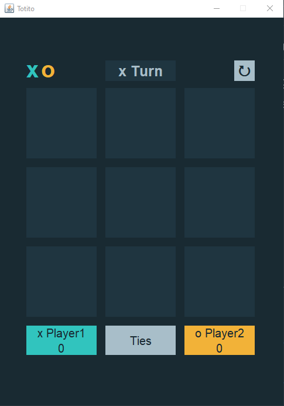
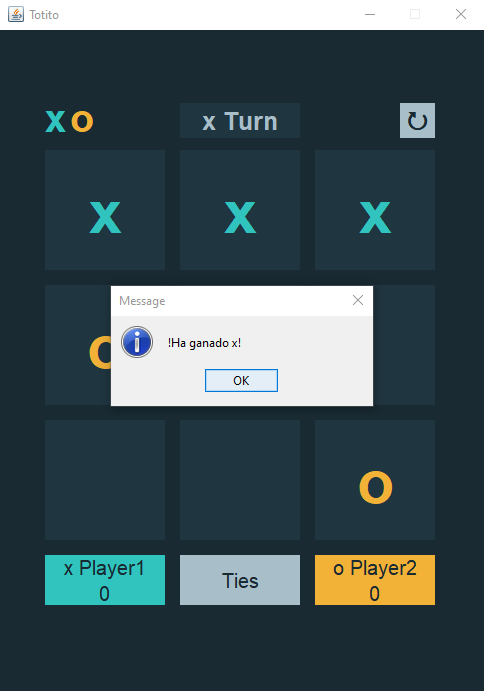
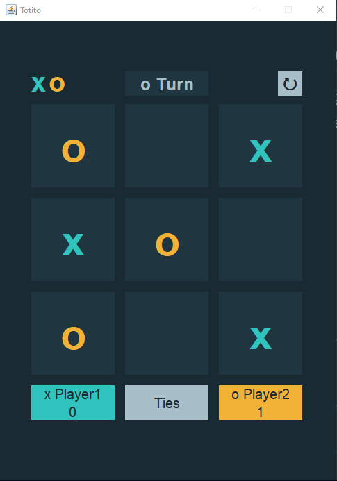
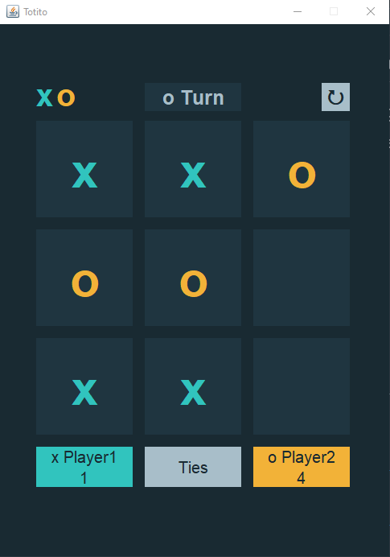

# **Tica Tac Toe Game** :video_game:
## Language: Java
## Interface: Java Swing and AWT

Totito is a game between two players **x** and **o**. Each player must only place his symbol once per turn and it must not be on an already occupied square, a straight or diagonal line must be achieved per symbol.

**Inspired by**: [Tic Tac Toe game](https://www.frontendmentor.io/challenges/tic-tac-toe-game-Re7ZF_E2v)

